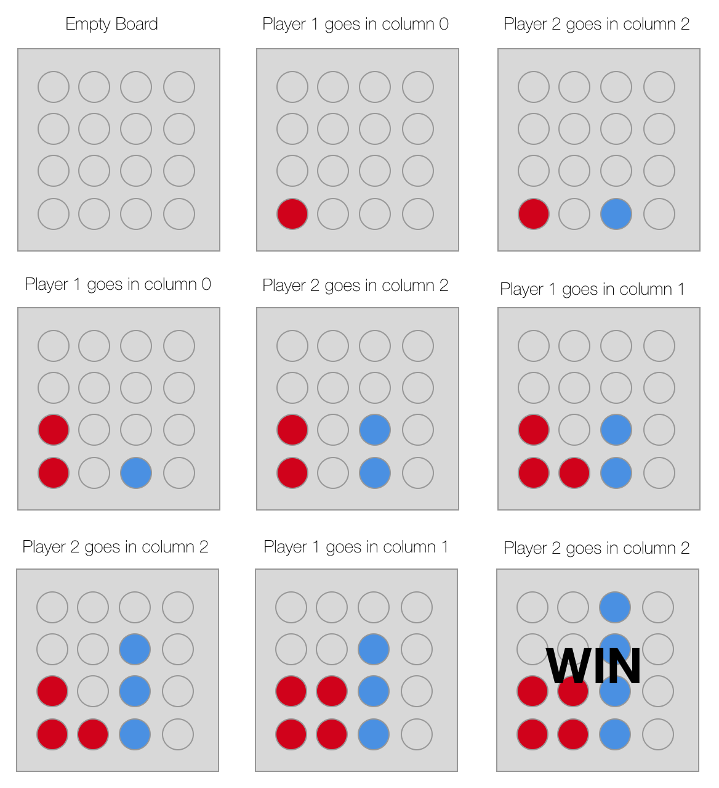

# 98point6 Data Engineer Homework

Welcome to 98point6's at-home interview question! The purpose of this exercise
is for you to demonstrate your data engineering competency by designing and
implementing a basic data warehouse with a database engine (like
[Amazon Redshift][0], PostgreSQL, MySQL, or similar). The data
warehouse will be used to understand player and game information for an
internal game, 98point6 Drop Token (described in next section).

[0]: https://aws.amazon.com/redshift/

Your task is to design a data warehouse for stakeholders to answer questions
about all the 98point6 Drop Token (9dt) players and games, and generally
explore the data. You have access to a CSV file with game data and a player
profile API that returns detailed player information based on the player id.

## Rules of the 98point6 Drop Token Game

9dt takes place on a 4x4 grid. A token is dropped along a column and said token
goes to the lowest unoccupied row of the board. A player wins when they have 4
tokens next to each other either along a row, in a column, or on a diagonal. If
the board is filled, and nobody has won then the game is a draw. Each player
takes a turn, starting with player 1, until the game reaches either win or
draw. If a player tries to put a token in a column that is already full, that
results in an error state, and the player must play again until the play a
valid move.

### Example Game



### 9dt game data

The [game_data.csv][1] file in this repository contains four columns with each row
indicating a single move by a single player in a game. The columns are:

1. `game_id` - Opaque string indicating with unique identifier for a specific
   game that was played between two players.

2. `player_id` - Opaque string indicating which player made a move.

3. `move_number` - Integer indicating the move number for this game. The first
   move of a game will have `1` as the `move_number`.

4. `column` - Integer column that the player dropped their token into.

5. `result` - Contains "win" when the move results in the player winning the
   game, "draw" if the move ends the game in draw, and is empty otherwise.

[1]: game_data.csv

### 9dt player profile API

There is a 9dt player profile API at the following location:
https://x37sv76kth.execute-api.us-west-1.amazonaws.com/prod/users. You can make
HTTP GET requests to the API to retrieve JSON formatted data about players, 10
at a time:

```
curl -X GET -H 'Accept: application/json' https://x37sv76kth.execute-api.us-west-1.amazonaws.com/prod/users?page=0
```

Increase the `page` query string parameter to get more players. An empty array
is returned when there are no more players (at time of writing, there were
~5000 players).

An example response is:

```json
[
  {
    "id": 3300,
    "data": {
      "gender": "male",
      "name": {
        "title": "monsieur",
        "first": "adrien",
        "last": "lambert"
      },
      "location": {
        "street": "2520 rue barrier",
        "city": "morges 2",
        "state": "nidwalden",
        "postcode": 9752
      },
      "email": "adrien.lambert@example.com",
      "login": {
        "username": "yellowgorilla717"
      },
      "dob": "1946-01-26 18:44:10",
      "registered": "2007-05-17 07:51:54",
      "phone": "(127)-093-1911",
      "cell": "(867)-527-4578",
      "id": {
        "name": "AVS",
        "value": "756.OUGI.JBUO.16"
      },
      "picture": {
        "large": "https://randomuser.me/api/portraits/men/81.jpg",
        "medium": "https://randomuser.me/api/portraits/med/men/81.jpg",
        "thumbnail": "https://randomuser.me/api/portraits/thumb/men/81.jpg"
      },
      "nat": "CH"
    }
  },
  ...
]
```

The `id` field at the top-level of each object in the response is the player id
(same as `player_id` in CSV). The `data` object has details about the player
like name, nationality (`nat`), email, and more (player data from
https://randomuser.me/).

### Analysis

Your data warehouse should enable its consumers to easily run the following
analyses:

1. Out of all the games, what is the percentile rank of each column used as the
   first move in a game? That is, when the first player is choosing a column
   for their first move, which column most frequently leads to that player
   winning the game?

2. How many games has each nationality of player played?

3. Marketing wants to send emails to players that have only played a single
   game. The email will be customized based on whether or not the player won,
   lost, or drew the game. Which players should receive an email, and with what
   customization?

There should be tables or views to support each of the above analyses. Please
include the table or view names that relate to each of the above analyses in
your submission.

## Submitting your implementation

We expect one deliverable in your submission with the scripts or executables
that setup the data warehouse, load the data, and transform it as
needed. Please include some documentation explaining how to run your scripts.

To submit the source code, configuration files, etc, the easiest way is to
share a Github or BitBucket repository with us (we will send you the
appropriate usernames). Alternatively, we can accept compressed tarballs or zip
archives. We cannot accept those over email, though, so we recommend a file
sharing service like Google Drive, Dropbox, or similar.

### Running your solution

If you use a database engine (like Redshift, PostgreSQL, MySQL, etc), please
include instructions for passing in the database connection information
(hostname, port, user, password, etc; a single JDBC style url is also fine). If
you use another tool for your data warehouse, please include detailed
instructions for how to setup that tool. We are experienced developers, but we
may not be familiar with the tools or languages you used, so please draft the
instructions for running your solution accordingly.

### External tools and platforms

Feel free to use whatever external tools, libraries, and platforms you feel are
best suited to solve the problem. It is not necessary to write the automation
for your solution from the ground up. You can use configuration tools, cloud
services, or utility libraries as you see fit.

## Assessment and Interview

After we receive your submission we will conduct a review of your solution and
execute some tests. We will assess your solution on the following criteria with
our review and testing:

* *Correctness*: Does your solution adhere to the specification and does it
   correctly answer the questions posed above?

* *Scalability*: If we were to scale the game data from its current form to
  millions of players and tens of millions of games will your solution continue
  to work without become unusably slow or otherwise broken?

* *Automation*: How easily is your solution executed and changed?

* *Readability*: Can an engineer unfamiliar with your implementation read and
  understand what you have implemented, and then make changes? This speaks to
  style, naming conventions, organization, and documentation.

On the day of your on-site interview you will present your solution to 2-3
members of the engineering team. You should prepare to talk about your
implementation approach, design trade offs, and approach to testing and
validation.

Through the course of the one-on-one interviews we will ask you further
questions about how you would extend your solution and how you would fix any
issues we find in our own testing and evaluation to improve your solution.
